<p align="center">
  
  
  
  
  
  
</p>

<h1 align="center">CrediProcure</h1>
<h3 align="center">On-chain B2B Invoice Financing Powered by Real World Assets on Creditcoin</h3>

<p align="center">
  Unlock liquidity for vendors, expose investors to transparent invoice-backed yield, and make financing lifecycle data auditable on-chain.
</p>

<p align="center">
  <a href="https://credi-procure.vercel.app"><strong>Live App</strong></a> ·
  <a href="https://youtu.be/c_65KWII4Kk"><strong>Demo Video</strong></a> ·
  <a href="./submission/CrediProcure_OnePager.html"><strong>Project One-Pager</strong></a> ·
  <a href="#live-deployment-references"><strong>Contract Addresses</strong></a>
</p>

---

## Overview

CrediProcure is a decentralized invoice financing platform built on Creditcoin.
It helps vendors convert business invoices into on-chain RWA assets and unlock liquidity faster,
while giving investors access to transparent, real-world-backed yield opportunities.

The MVP includes:

- Invoice minting as ERC-721 RWAs
- Direct invoice funding through marketplace
- Liquidity pool participation for LP-style capital
- On-chain repayment tracking
- Vendor credit history from protocol events
- Investor portfolio tracking from funding and repayment events

---

## The Problem

Small and medium businesses frequently wait 30 to 90 days to get paid.
Traditional invoice financing is slow, opaque, and dependent on intermediaries.
At the same time, DeFi investors have limited access to stable real-world-backed yield products.

### Key pain points

- Slow payment cycles weaken vendor cash flow.
- Factoring access is limited and operationally heavy.
- Funding terms and lifecycle visibility are often opaque.
- DeFi capital lacks transparent real-world yield rails.

### Market context

| Metric | Value |
|:---|:---|
| Global trade finance gap | $3.6 trillion |
| Typical invoice settlement delay | 30-90 days |
| Target user | SMEs needing working capital |
| Investor need | Transparent RWA yield with auditable state |

---

## The Solution

CrediProcure turns invoices into programmable on-chain assets.
Vendors create invoices, mint them as RWAs, and open funding opportunities.
Investors can fund specific invoices directly or provide liquidity through a shared pool.

### Protocol flow

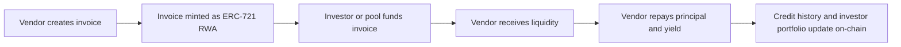

### Lifecycle summary

1. Vendor creates an invoice with amount, due date, and yield.
2. Invoice is minted on Creditcoin as an RWA NFT.
3. Investor funds directly or via pooled liquidity.
4. Repayment is recorded on-chain and reflected in dashboard analytics.

---

## Product Walkthrough

This section uses actual product screenshots for end-to-end flow clarity.

### Landing and protocol narrative

<table>
  <tr>
    <td width="50%">
      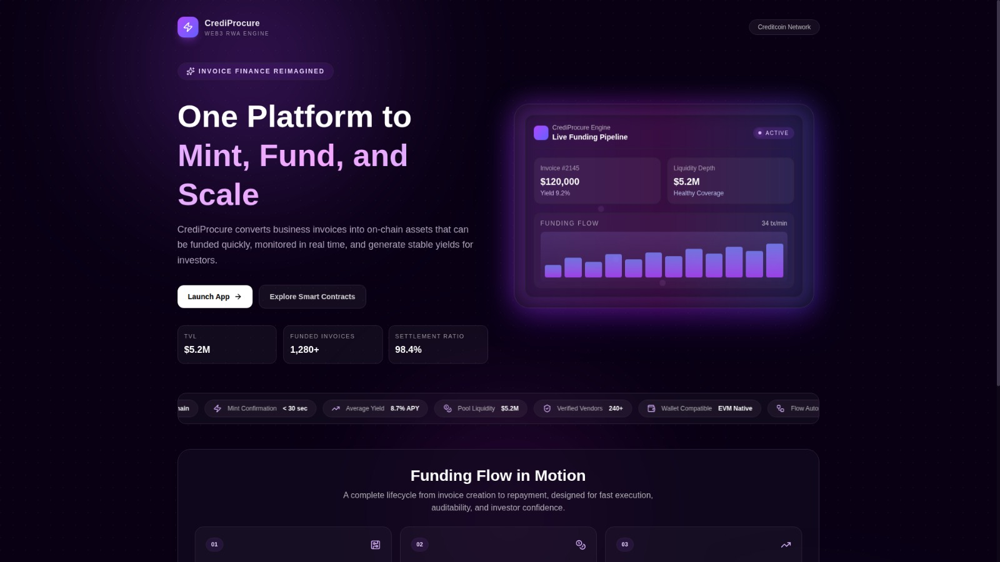
    </td>
    <td width="50%">
      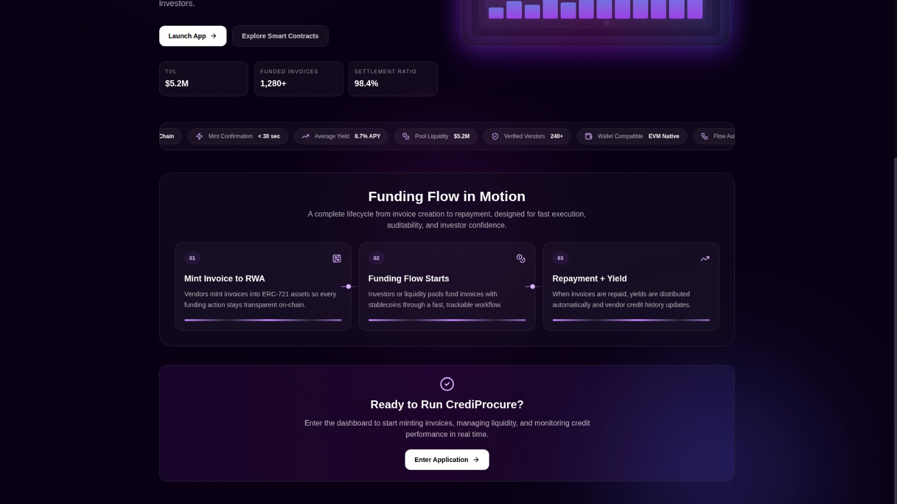
    </td>
  </tr>
  <tr>
    <td align="center"><sub>Landing value proposition and core protocol metrics.</sub></td>
    <td align="center"><sub>Narrative flow for mint, fund, and repay lifecycle.</sub></td>
  </tr>
</table>

### Vendor journey

<table>
  <tr>
    <td width="50%">
      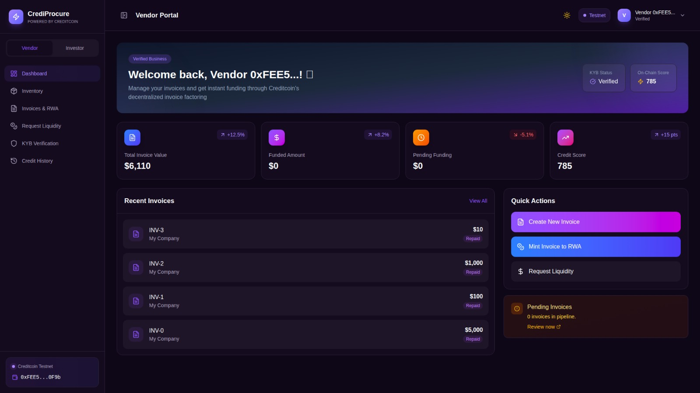
    </td>
    <td width="50%">
      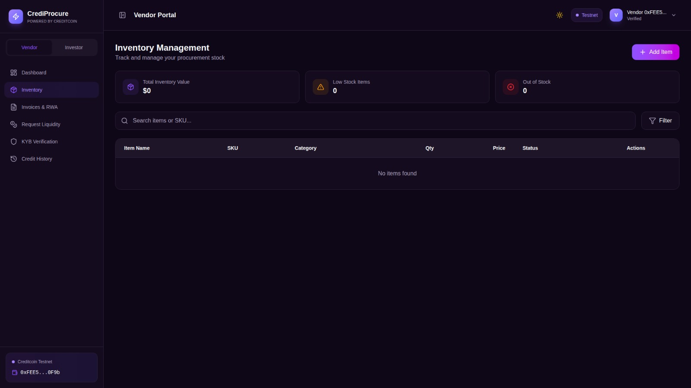
    </td>
  </tr>
  <tr>
    <td align="center"><sub>Vendor dashboard for invoice and funding monitoring.</sub></td>
    <td align="center"><sub>Inventory tracking for procurement operations.</sub></td>
  </tr>
  <tr>
    <td width="50%">
      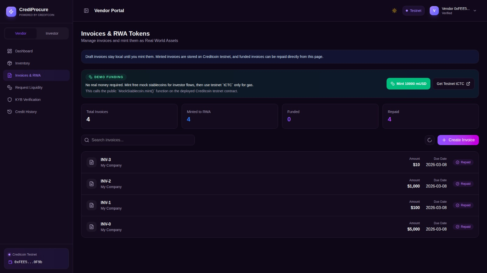
    </td>
    <td width="50%">
      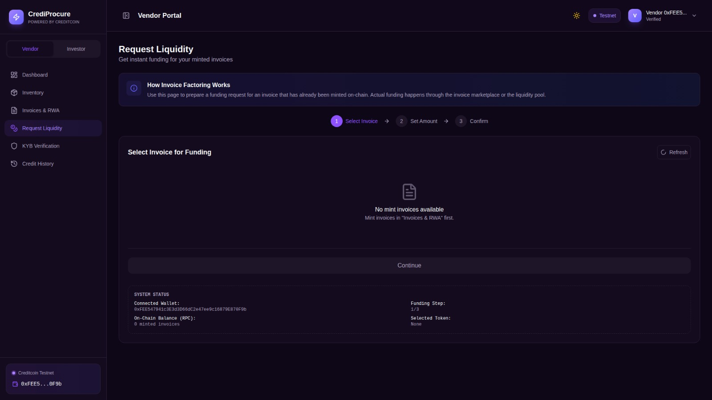
    </td>
  </tr>
  <tr>
    <td align="center"><sub>Invoice management and on-chain RWA minting.</sub></td>
    <td align="center"><sub>Liquidity request preparation and funding terms.</sub></td>
  </tr>
  <tr>
    <td width="50%">
      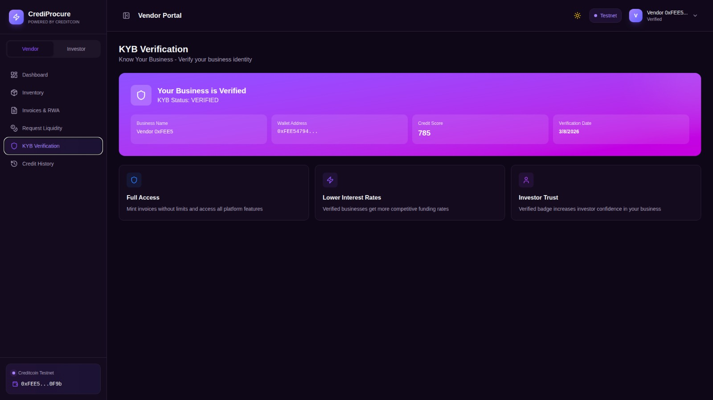
    </td>
    <td width="50%">
      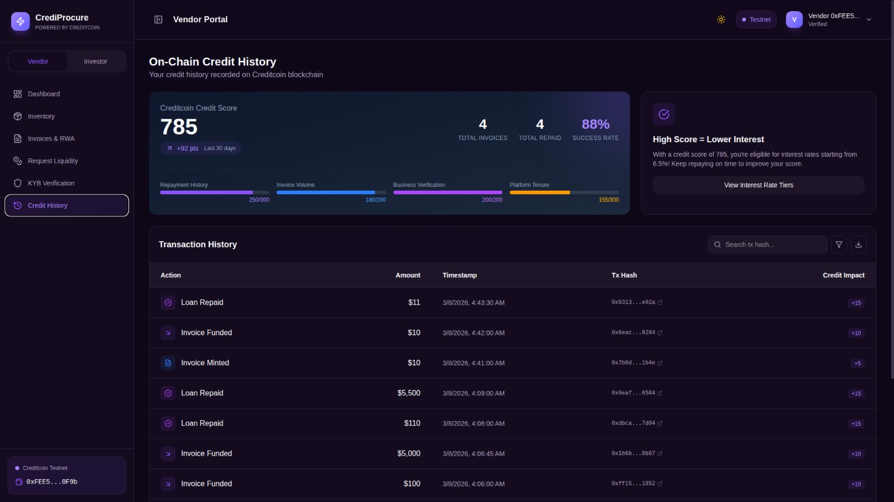
    </td>
  </tr>
  <tr>
    <td align="center"><sub>KYB process for compliance readiness.</sub></td>
    <td align="center"><sub>On-chain credit history generated from protocol events.</sub></td>
  </tr>
</table>

### Investor journey

<table>
  <tr>
    <td width="50%">
      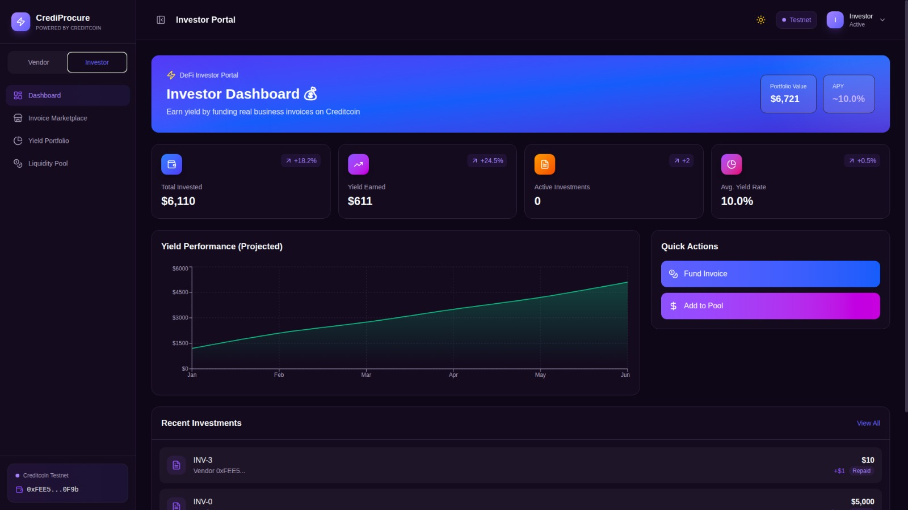
    </td>
    <td width="50%">
      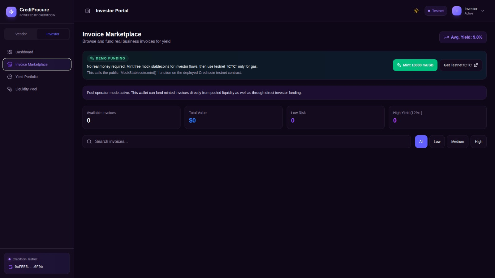
    </td>
  </tr>
  <tr>
    <td align="center"><sub>Investor dashboard with allocation and performance summary.</sub></td>
    <td align="center"><sub>Marketplace for direct invoice funding.</sub></td>
  </tr>
  <tr>
    <td width="50%">
      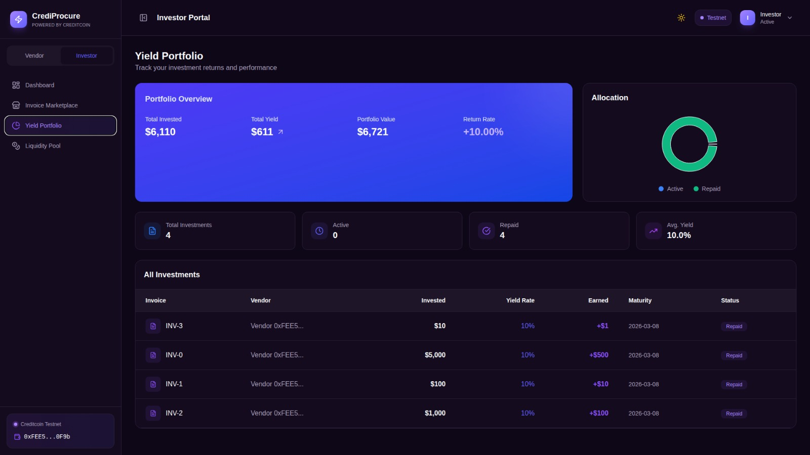
    </td>
    <td width="50%">
      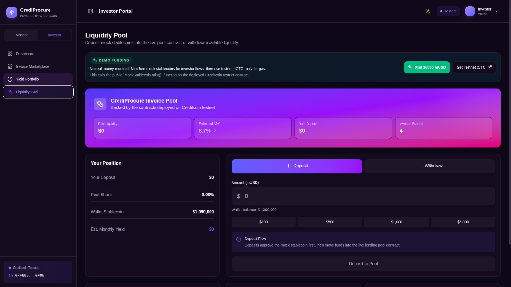
    </td>
  </tr>
  <tr>
    <td align="center"><sub>Portfolio tracking for direct funding positions.</sub></td>
    <td align="center"><sub>Pool deposit and withdrawal flow for shared liquidity.</sub></td>
  </tr>
</table>

---

## Key Features

### Vendor portal

- Real-time dashboard combining local drafts and on-chain invoice reads
- Invoice creation and self-minting as ERC-721 RWAs on Creditcoin
- Liquidity request preparation flow with funding terms
- Inventory management with local persistence
- KYB verification workflow
- Credit history derived from `InvoiceMinted`, `InvoiceFunded`, and `LoanRepaid` events

### Investor portal

- Invoice marketplace with direct invoice funding
- Yield portfolio tracking from on-chain activity
- Liquidity pool deposit and withdrawal against deployed pool contract
- Performance visualization for investor positions
- Direct and pool-based capital deployment paths

### Blockchain and Web3

- Wallet support: MetaMask, Phantom (EVM mode), Bitget Wallet
- Automatic Creditcoin testnet network switching
- Live contract reads for marketplace, pool balances, and event-driven analytics
- Responsive UI for desktop and mobile testing

---

## Smart Contract Architecture

The protocol uses three core contracts deployed on Creditcoin testnet.

### InvoiceNFT.sol

- ERC-721 invoice tokenization layer
- Stores immutable invoice metadata and status
- Supports self-minting and lifecycle updates from pool contract

### LendingPool.sol

- Capital coordination engine for pool and direct funding
- Supports deposit, withdraw, direct funding, pooled funding, and repay
- Updates invoice lifecycle state through controlled integration

### MockStablecoin.sol

- ERC-20 test token used for deterministic demo flow
- Public mint for test environment execution

---

## Current Deployment Notes

The current testnet deployment is optimized for judge and evaluator testing.

1. Self-serve demo flow:
- Vendor can mint invoices directly on-chain.
- Investor can mint demo `mUSD` and fund invoices without real capital.
- Vendor can repay funded invoices from app flow.

2. Real contract reads where it matters:
- Marketplace inventory, pool balances, funding activity, and credit history are loaded from on-chain state and events.

3. Honest MVP boundaries:
- Inventory, KYB status, and drafts are local-first for speed.
- Liquidity request is a preparation flow, not yet escrow queue.

---

## Tech Stack

| Layer | Technology | Version |
|:---|:---|:---|
| Frontend | React + Vite | 19.2 + 7.2 |
| Language | TypeScript | 5.9 |
| Styling | Tailwind CSS | 4.1 |
| Data Viz | Recharts | 3.7 |
| Web3 Library | Ethers.js | 6.16 |
| Smart Contracts | Solidity + Hardhat | 0.8.20 |
| Contract Libraries | OpenZeppelin | 5.x |
| Blockchain | Creditcoin Testnet | - |

---

## Project Structure

```text
CrediProcure/
├── src/
├── smart-contracts/
├── submission/
│   ├── CrediProcure_OnePager.html
│   └── screenshots/
│       ├── 01-landing-hero.jpeg
│       ├── 02-landing-flow.jpeg
│       ├── 03-vendor-dashboard.jpeg
│       ├── 04-vendor-inventory.jpeg
│       ├── 05-vendor-invoices-rwa.jpeg
│       ├── 06-vendor-request-liquidity.jpeg
│       ├── 07-vendor-kyb.jpeg
│       ├── 08-vendor-credit-history.jpeg
│       ├── 09-investor-dashboard.jpeg
│       ├── 10-investor-marketplace.jpeg
│       ├── 11-investor-yield-portfolio.jpeg
│       └── 12-investor-liquidity-pool.jpeg
└── README.md
```

---

## Getting Started

### Prerequisites

- Node.js >= 18
- MetaMask or compatible EVM wallet
- Creditcoin testnet `tCTC` from faucet

### Frontend setup

```bash
git clone https://github.com/panzauto46-bot/CrediProcure.git
cd CrediProcure
npm install
npm run dev
```

### Smart contract setup

```bash
cd smart-contracts
npm install
npx hardhat compile
npx hardhat test
npx hardhat run scripts/deploy.ts --network creditcoinTestnet
```

After deployment, update contract addresses in `src/context/WalletContext.tsx`.

---

## Network Configuration

| Parameter | Value |
|:---|:---|
| Network Name | Creditcoin Testnet |
| RPC URL | `https://rpc.cc3-testnet.creditcoin.network` |
| Chain ID | `102031` |
| Currency Symbol | `tCTC` |
| Block Explorer | `https://creditcoin-testnet.blockscout.com/` |

---

## Live Deployment References

### Frontend

- App URL: `https://credi-procure.vercel.app`
- Repository: `https://github.com/panzauto46-bot/CrediProcure`

### Smart contracts (Creditcoin testnet)

- InvoiceNFT: `0x6ab882c6C0e0c58B0487134b5221525B439C4C03`
- LendingPool: `0x5fe9567496A8c101c062943ed152c78c3d80370a`
- MockStablecoin: `0x7a3817f06d99db5969110765660d05Aa4646285F`

### Explorer links

- InvoiceNFT: `https://creditcoin-testnet.blockscout.com/address/0x6ab882c6C0e0c58B0487134b5221525B439C4C03`
- LendingPool: `https://creditcoin-testnet.blockscout.com/address/0x5fe9567496A8c101c062943ed152c78c3d80370a`
- MockStablecoin: `https://creditcoin-testnet.blockscout.com/address/0x7a3817f06d99db5969110765660d05Aa4646285F`

---

## Submission Artifacts (DoraHacks)

- Project Sector: DeFi + RWA
- Project Deck (HTML): `./submission/CrediProcure_PitchDeck.html`
- Project Deck (PDF): `./submission/CrediProcure_PitchDeck.pdf`
- Whitepaper (HTML): `./submission/CrediProcure_Whitepaper.html`
- Whitepaper (PDF): `./submission/CrediProcure_Whitepaper.pdf`
- Project One-Pager: `./submission/CrediProcure_OnePager.html`
- Prototype Demo Video: `https://youtu.be/c_65KWII4Kk`

---

## Security Considerations

- Uses OpenZeppelin libraries for core primitives
- Uses `ReentrancyGuard` for financial functions
- Uses `Ownable` controls for sensitive operations
- Uses pool-only guard for lifecycle transitions
- Keeps private keys in `.env` files excluded from git
- Requires formal audit before production launch

---

## Roadmap

| Phase | Focus | Status |
|:---:|:---|:---:|
| 1 | Product UX and core portal flows | Complete |
| 2 | Smart contracts and testnet deployment | Complete |
| 3 | Wallet and on-chain integration | Complete |
| 4 | End-to-end testnet validation | Complete |
| 5 | Submission and documentation | Complete |
| 6 | Risk scoring, syndication, analytics | Next |
| 7 | Compliance and mainnet readiness | Planned |

---

## Team

| Name | Role |
|:---|:---|
| Pandu Dargah | Full-Stack Developer and Founder |

---

## License

This project is licensed under MIT. See [LICENSE](LICENSE) for details.

---

<p align="center">
  <b>© 2026 CrediProcure</b><br/>
  Built for transparent real-world finance rails on Creditcoin.
</p>
